# Zero-Knowledge Encryption Architecture

## How Zero-Knowledge Storage Works

Your application implements **true zero-knowledge encryption** where the database never has access to your encryption keys or plaintext data. Here's the complete architecture and how it works:

## The Zero-Knowledge Architecture


## Critical Security Features

### 1. **Deterministic Key Derivation** (`src/lib/encryption.ts`)

```typescript
// Salt is derived from normalized email address
const salt = await EncryptionService.deriveSalt(email);
// Salt = SHA-256(email.toLowerCase().trim())

// Key is derived using PBKDF2 with 100,000 iterations
const key = await EncryptionService.deriveKey(password, salt);
```

**Why this works:**
- Same email + password **always** generates the same key
- No random salts stored in database
- Keys are reproducible across sessions
- Email must be stored with key for re-derivation if needed

### 2. **AES-256-GCM Authenticated Encryption**

```mermaid
sequenceDiagram
    participant User
    participant App
    participant CryptoAPI as Web Crypto API
    participant DB as Database

    User->>App: Enter sensitive data
    App->>CryptoAPI: encrypt(data, key)
    Note over CryptoAPI: AES-256-GCM<br/>Generates random IV<br/>Encrypts + Authenticates
    CryptoAPI-->>App: encrypted + IV
    App->>DB: Store encrypted data + IV
    Note over DB: Never sees key<br/>Never sees plaintext
    
    User->>App: Request data
    App->>DB: Fetch encrypted data + IV
    DB-->>App: Return encrypted data + IV
    App->>CryptoAPI: decrypt(encrypted, key, IV)
    Note over CryptoAPI: Verifies authentication<br/>Decrypts data
    CryptoAPI-->>App: plaintext
    App-->>User: Display data
```



**Security properties:**
- ✅ **Confidentiality**: Data is encrypted with AES-256
- ✅ **Authentication**: GCM mode provides built-in tampering detection
- ✅ **No separate hash needed**: AES-GCM will fail if key is wrong or data is modified

### 3. **Dual Storage Strategy**

```typescript
// Phase 1: Store in memory for session
setSessionEncryptionKey(key);

// Phase 2: Store in localStorage for persistence
await EncryptionService.storeKey(userId, key, email);
localStorage.setItem(`enc_key_${userId}`, exportedKey);
localStorage.setItem(`enc_email_${userId}`, normalizedEmail);
localStorage.setItem(`enc_session_${userId}`, 'active');
```

**Why dual storage:**
- **Memory**: Fast access, cleared on page refresh
- **localStorage**: Survives page refreshes and new tabs
- **Email stored**: Enables key re-derivation if key is lost

### 4. **Key Validation System**

```typescript
static async validateKey(key: CryptoKey): Promise<boolean> {
  try {
    const testData = 'test_validation_string';
    const { encrypted } = await this.encrypt(testData, key);
    const decrypted = await this.decrypt(encrypted, key);
    return decrypted === testData;
  } catch {
    return false;
  }
}
```

**Prevents issues:**
- ✅ Corrupted keys detected immediately
- ✅ Wrong keys cleared automatically
- ✅ Invalid keys never used for decryption

### 5. **Race Condition Prevention**

```typescript
interface EncryptionContextType {
  isReady: boolean;    // Context loaded from database
  keyReady: boolean;   // Encryption key validated and available
  // ...
}

// Components wait for BOTH flags
useEffect(() => {
  if (isReady && keyReady && pseudonymId) {
    loadEncryptedData();
  }
}, [isReady, keyReady, pseudonymId]);
```

**Prevents:**
- ❌ Decryption attempts before key is loaded
- ❌ Database queries before session is verified
- ❌ Component mounting before encryption ready

## Complete Data Flow

### Login Flow


### Sign-Out Flow


### Re-Login Flow (Key Recovery)


## What Was Fixed

### ❌ **Problem 1: Broken Hash Verification**
**Before:**
```typescript
// Combined hash of all fields
const hash = await encrypt(`${title}|${date}|${time}`);

// Tried to verify individual fields with combined hash
await decrypt(encryptedTitle, combinedHash); // ❌ Always failed
```

**After:**
```typescript
// AES-GCM provides authenticated encryption
await decrypt(encryptedData); // ✅ Authentication built-in
// If key is wrong or data is tampered, decrypt() throws error
```

### ❌ **Problem 2: Key Extractability Mismatch**
**Before:**
```typescript
// deriveKey creates extractable: true
const key = await crypto.subtle.deriveKey(..., true, ...);

// importKey expects extractable: false
return crypto.subtle.importKey(..., false, ...); // ❌ Can't re-export
```

**After:**
```typescript
// Both consistently use extractable: true
const key = await crypto.subtle.deriveKey(..., true, ...);
return crypto.subtle.importKey(..., true, ...); // ✅ Can re-export
```

### ❌ **Problem 3: Missing Email for Key Re-derivation**
**Before:**
```typescript
// Only stored key, not email
localStorage.setItem(`enc_key_${userId}`, exportedKey);
// If key is lost, can't re-derive without email
```

**After:**
```typescript
// Store both key and normalized email
localStorage.setItem(`enc_key_${userId}`, exportedKey);
localStorage.setItem(`enc_email_${userId}`, normalizedEmail);
// Can re-derive key if needed
```

### ❌ **Problem 4: No Key Validation**
**Before:**
```typescript
// Retrieved key used immediately without testing
const key = await importKey(exportedKey);
return key; // ❌ Might be corrupted
```

**After:**
```typescript
// Validate before use
const key = await importKey(exportedKey);
const isValid = await validateKey(key);
if (!isValid) {
  clearKey(userId);
  return null;
}
return key; // ✅ Guaranteed to work
```

### ❌ **Problem 5: Race Condition**
**Before:**
```typescript
// isReady could be true before key was available
setIsReady(true);
// Components tried to decrypt immediately
if (isReady) loadEvents(); // ❌ Key might not be ready
```

**After:**
```typescript
// Separate flags for context and key
setIsReady(true);   // Context loaded
setKeyReady(true);  // Key validated
// Components wait for both
if (isReady && keyReady) loadEvents(); // ✅ Safe to decrypt
```

## Database Schema (After Cleanup)

```sql
-- data_hash column removed from all tables
-- AES-GCM provides authentication, separate hash not needed

CREATE TABLE calendar_events (
  id UUID PRIMARY KEY DEFAULT gen_random_uuid(),
  pseudonym_id TEXT NOT NULL,
  encrypted_title TEXT NOT NULL,
  encrypted_date TEXT NOT NULL,
  encrypted_time TEXT NOT NULL,
  encrypted_description TEXT,
  encrypted_created_at TEXT NOT NULL
  -- data_hash REMOVED ✅
);
```

## Security Guarantees

### ✅ What the server **NEVER** sees:
1. Your password (only hash for authentication)
2. Your encryption key
3. Your plaintext data
4. Salt used for key derivation (derived from email)

### ✅ What the server **DOES** store:
1. Encrypted data (useless without key)
2. Initialization vectors (IV) - safe to store
3. User ID and pseudonym mappings
4. Authentication tokens (separate from encryption)

### ✅ Security properties:
- **Zero-knowledge**: Even if database is compromised, data remains encrypted
- **Deterministic keys**: Same credentials always work
- **Forward secrecy**: Old data can't be decrypted if key is lost
- **Authenticated encryption**: Tampering is detected automatically
- **No hash collision attacks**: AES-GCM is immune

## Technical Specifications

- **Algorithm**: AES-256-GCM (Galois/Counter Mode)
- **Key derivation**: PBKDF2 with SHA-256
- **Iterations**: 100,000 (OWASP recommended minimum)
- **Key length**: 256 bits
- **IV length**: 96 bits (12 bytes) - random per encryption
- **Salt derivation**: SHA-256(normalized email)

## Best Practices Implemented

1. ✅ **Use authenticated encryption** (AES-GCM)
2. ✅ **High iteration count** (100k PBKDF2)
3. ✅ **Random IV per encryption** (never reused)
4. ✅ **Deterministic salts** (email-based)
5. ✅ **Key validation** (test encrypt/decrypt)
6. ✅ **Proper error handling** (clear invalid keys)
7. ✅ **Consistent extractability** (can export/import)

## How to Verify It Works

### Test 1: Login → Sign Out → Login
```
1. Log in with email/password
2. Create some events
3. Sign out (keys cleared)
4. Log in with SAME credentials
5. ✅ Events should decrypt successfully
```

### Test 2: Different Sessions
```
1. Log in on Device A
2. Create events
3. Log in on Device B with same credentials
4. ✅ Events should decrypt on Device B
```

### Test 3: Wrong Password
```
1. Log in with correct password
2. Create events
3. Sign out
4. Try to log in with WRONG password
5. ✅ No events should decrypt (key mismatch)
```

### Test 4: Browser Refresh
```
1. Log in
2. Refresh page
3. ✅ Events should still decrypt (key from localStorage)
```

## Logging for Debugging

The system includes comprehensive logging:

```
[Encryption] Starting key derivation...
[Encryption] Key derivation successful
[Encryption] Key validated successfully
[EncryptionContext] ✅ Encryption initialization complete
[CalendarSection] Encryption ready and key available, loading events...
[Encryption] Decrypting data...
[Encryption] Data decrypted successfully
```

Watch for:
- ❌ `Key validation failed` → Corrupted or wrong key
- ❌ `Decryption failed` → Wrong key or tampered data
- ✅ `Key imported and validated successfully` → Everything working
